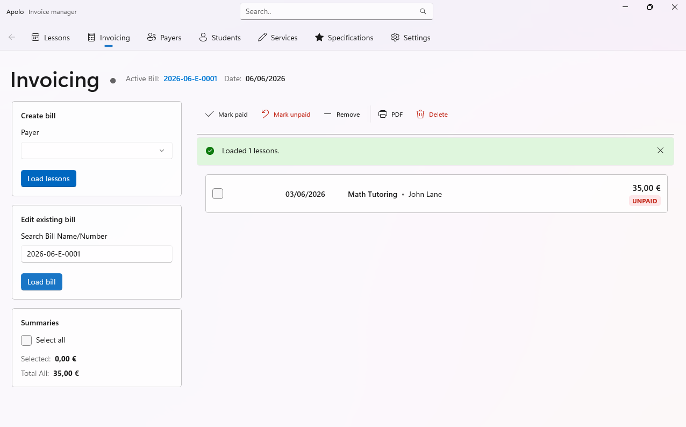

<h1 align="center">
    Apolo
</h1>

  

<h3 align="center">
  <a href="https://github.com/alexruizdev/Apolo/wiki">Apolo Wiki</a>
   · 
  <a href="https://apps.microsoft.com/detail/9pl7kt6rhhgp?hl=en-US&gl=ES">Install</a>
   · 
  <a href="https://github.com/alexruizdev/Apolo/releases/">Release notes</a>
</h3>

Apolo is a comprehensive lesson and billing management system designed for tutors, instructors, and service providers. It helps you manage students, schedule lessons, track services, and handle billing all in one place (as an alternative to use Excel).

  
  

## Table of Contents

- [Features](#features)
- [System Requirements](#system-requirements)
- [Installation](#installation)
- [Usage](#usage)
- [Contributing](#contributing)
- [License](#license)
- [Contact](#contact)

## Features

- **Student Management** - Add, edit, and manage student information
- **Lesson Tracking** - Easy record (using specifications) and track lessons 
- **Billing & Invoicing** - Generate and manage billing documents and invoices
- **Service Management** - Define and manage various services
- **Payer Management** - Track and manage payment information
- **Excel Integration** - Export and import data to/from Excel
- **Settings Management** - Configurable application settings

## System Requirements

- **Windows** 10 or later
- **.NET Runtime** 8.0 or higher
- **Disk Space** ~100 MB for installation

## Installation

Install it from the [Microsoft Store](https://apps.microsoft.com/detail/9pl7kt6rhhgp?hl=en-US&gl=ES).

  <a style="text-decoration:none" href="https://apps.microsoft.com/detail/9pl7kt6rhhgp?launch=true&mode=full">
    <picture>
      <source media="(prefers-color-scheme: light)" srcset="Documentation/Pictures/StoreBadge-dark.png" width="220" />
      
  </picture></a>

## Usage

**New to Apolo?** Start with our [Quick Start Guide](https://github.com/alexruizdev/Apolo/wiki/Getting-Started) on the wiki.

For detailed documentation and tutorials with screenshots, please visit our [Apolo Wiki](https://github.com/alexruizdev/Apolo/wiki).

## Contributing

Contributions are welcome! To contribute:

1. Fork the repository
2. Create a feature branch (`git checkout -b feature/YourFeatureName`)
3. Commit your changes (`git commit -m 'Add some feature'`)
4. Push to the branch (`git push origin feature/YourFeatureName`)
5. Open a Pull Request

Please ensure:
- Code follows the existing style conventions
- New features include appropriate unit tests
- Tests pass before submitting PR

## License

This project is licensed under the terms specified in [LICENSE.txt](LICENSE.txt).

## Contact

**Author**: Alex Ruiz  
**GitHub**: [alexruizdev](https://github.com/alexruizdev)  

---

For issues, questions, or suggestions, please open an issue on the [GitHub repository](https://github.com/alexruizdev/Apolo/issues).